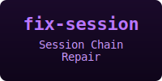

<div align="center">

<a href="https://pchalasani.github.io/claude-code-tools/">

</a>

CLI tools, skills, agents, hooks, and plugins for enhancing productivity with Claude Code and other coding agents.

[](https://pchalasani.github.io/claude-code-tools/)
[](https://github.com/pchalasani/claude-code-tools/releases?q=rust)

</div>

## [Full Documentation](https://pchalasani.github.io/claude-code-tools/)

## Install

```bash
# Core package
uv tool install claude-code-tools

# With Google Docs/Sheets extras
uv tool install "claude-code-tools[gdocs]"

# Upgrade an existing installation
uv tool install --force claude-code-tools
```

The search engine (`aichat search`) requires a
separate Rust binary:

- **Homebrew** (macOS/Linux):
  `brew install pchalasani/tap/aichat-search`
- **Cargo**: `cargo install aichat-search`
- **Pre-built binary**:
  [Releases](https://github.com/pchalasani/claude-code-tools/releases)
  (look for `rust-v*`)

Install the Claude Code
[plugins](https://pchalasani.github.io/claude-code-tools/getting-started/plugins/)
for hooks, skills, and agents:

```bash
claude plugin marketplace add pchalasani/claude-code-tools
```

---

Click a card to jump to that feature, or
**[read the full docs](https://pchalasani.github.io/claude-code-tools/)**.

<div align="center">

<table>
<tr>
<td align="center">
<a href="https://pchalasani.github.io/claude-code-tools/getting-started/">

</a>
</td>
<td align="center">
<a href="https://pchalasani.github.io/claude-code-tools/getting-started/plugins/">

</a>
</td>
</tr>
</table>

<table>
<tr>
<td align="center">
<a href="https://pchalasani.github.io/claude-code-tools/tools/aichat/">

</a>
</td>
<td align="center">
<a href="https://pchalasani.github.io/claude-code-tools/tools/tmux-cli/">

</a>
</td>
<td align="center">
<a href="https://pchalasani.github.io/claude-code-tools/tools/lmsh/">

</a>
</td>
</tr>
<tr>
<td align="center">
<a href="https://pchalasani.github.io/claude-code-tools/tools/vault/">

</a>
</td>
<td align="center">
<a href="https://pchalasani.github.io/claude-code-tools/tools/env-safe/">

</a>
</td>
<td align="center">
<a href="https://pchalasani.github.io/claude-code-tools/plugins-detail/safety-hooks/">

</a>
</td>
</tr>
<tr>
<td align="center">
<a href="https://pchalasani.github.io/claude-code-tools/tools/statusline/">

</a>
</td>
<td align="center">
<a href="https://pchalasani.github.io/claude-code-tools/integrations/google-docs/">

</a>
</td>
<td align="center">
<a href="https://pchalasani.github.io/claude-code-tools/integrations/google-sheets/">

</a>
</td>
</tr>
<tr>
<td align="center">
<a href="https://pchalasani.github.io/claude-code-tools/integrations/alt-llm-providers/">

</a>
</td>
<td align="center">
<a href="https://pchalasani.github.io/claude-code-tools/plugins-detail/voice/">

</a>
</td>
<td align="center">
<a href="https://pchalasani.github.io/claude-code-tools/tools/fix-session/">

</a>
</td>
</tr>
</table>

<table>
<tr>
<td align="center">
<a href="https://pchalasani.github.io/claude-code-tools/development/">

</a>
</td>
<td align="center">
<a href="LICENSE">

</a>
</td>
</tr>
</table>

</div>

---

> **Legacy links** — The sections below exist to
> preserve links shared in earlier discussions.
> For current documentation, visit the
> [full docs site](https://pchalasani.github.io/claude-code-tools/).

<a id="aichat-session-management"></a>
## aichat — Session Management
See [aichat](https://pchalasani.github.io/claude-code-tools/tools/aichat/) in the full documentation.

<a id="tmux-cli-terminal-automation"></a>
## tmux-cli — Terminal Automation
See [tmux-cli](https://pchalasani.github.io/claude-code-tools/tools/tmux-cli/) in the full documentation.

<a id="voice"></a>
## Voice Plugin
See [Voice](https://pchalasani.github.io/claude-code-tools/plugins-detail/voice/) in the full documentation.

<a id="license"></a>
## License

MIT
